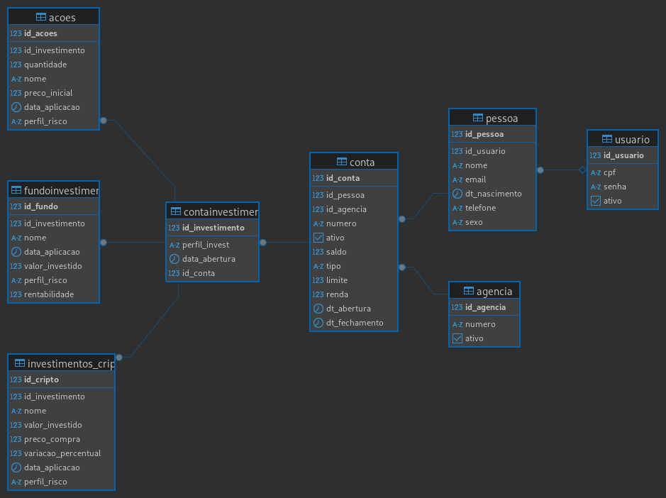

# FinUp Investimentos


**Tabela de Conteúdo**

- [FinUp Investimentos](#finup-investimentos)
  - [Descrição](#descrição)
  - [Funcionalidades](#funcionalidades)
  - [Tecnologias Utilizadas](#tecnologias-utilizadas)
  - [Instalação](#instalação)
  - [Uso](#uso)
  - [Estrutura de Pastas](#estrutura-de-pastas)
  - [ETL - Processamento de Dados](#etl---processamento-de-dados)
  - [RAG com Gemini](#rag-com-gemini)
  - [Licença](#licença)
  - [Imagens do Projeto](#imagens-do-projeto)

## Descrição

O projeto FinUp AjudAI Investimentos é uma aplicação desenvolvida para auxiliar investidores na análise e acompanhamento de diversos ativos financeiros. Ele integra dados de ações, câmbio, criptomoedas e índices econômicos, fornecendo uma visão consolidada do mercado. Além disso, conta com um sistema de perguntas e respostas (RAG) integrado com o Gemini para tirar dúvidas sobre o mercado financeiro. O projeto possui um layout construido em `Streamlit`.

## Funcionalidades

- **Dashboard Interativo:** Uma interface web para visualizar dados financeiros.
- **ETL (Extract, Transform, Load):** Processamento automatizado de dados de diferentes fontes.
- **Acompanhamento de Ativos:** Visualização de informações sobre ações brasileiras, câmbio e criptomoedas.
- **Indicadores Econômicos:** Monitoramento de principais indicadores econômicos.
- **RAG (Retrieval-Augmented Generation):** Sistema de Perguntas e Respostas com Gemini para sanar dúvidas.
- **Banco de Dados:** Gerenciamento local de dados com `ChromaDB` e `SQLite`.
- **Autenticação**: O projeto contem um sistema simples de autenticação de usuarios.

## Tecnologias Utilizadas

- **Python 3.10+:** Linguagem de programação principal.
- **Streamlit:** Framework para criação da interface web.
- **SQLite:** Sistema de gerenciamento de banco de dados relacional.
- **ChromaDB:** Banco de dados vetorial para o sistema RAG.
- **Google Gemini:** Modelo de linguagem para o sistema de Perguntas e Respostas.
- **Pandas:** Biblioteca para manipulação e análise de dados.
- **Requests:** Biblioteca para fazer requisições HTTP.
- **Beautiful Soup:** Biblioteca para web scraping.
- **Outras:** Verifique o arquivo `requirements.txt` para a lista completa de dependências.

## Instalação

1. **Clone o Repositório:**

    ```bash
    git clone https://github.com/thiagoregueira/Dash_Projeto_Final_DBC_Postgres
    cd Dash_Projeto_Final_DBC_Postgres
    ```

2. **Crie um Ambiente Virtual (recomendado):**

    ```bash
    python3 -m venv venv
    source venv/bin/activate  # Linux/macOS
    venv\Scripts\activate  # Windows
    ```

3. **Instale as Dependências:**

    ```bash
    pip install -r requirements.txt
    ```

## Uso

1. **Execute o ETL**:
    - O projeto contem uma script `main_process.py` para executar todo o processo de ETL.

    ```bash
    python main_process.py
    ```

2. **Execute o Aplicativo:**

    ```bash
    streamlit run Home.py
    ```

3. **Acesse o Aplicativo:**
    - O aplicativo estará disponível no seu navegador, geralmente em `http://localhost:8501`.

## Estrutura de Pastas

- **`auth/`:** Módulo para autenticação de usuários.
  - `user.py`: Lógica de gerenciamento de usuários.
  - `token.json`: Armazenamento de tokens
- **`chroma/`:** Banco de dados vetorial ChromaDB.
  - `chroma.sqlite3`: Arquivo de banco de dados principal do ChromaDB.
  - `281905e4-e6b3-4cd5-9f15-4638d07d16e4/` : Informações relacionadas ao banco de dados.
- **`db/`:** Módulo para interação com o banco de dados.
  - `db.py`: Funções de interação com o banco de dados.
- **`etl/`:** Scripts para o processo ETL.
  - `acoes.py`: Script para processar dados de ações.
  - `cambio.py`: Script para processar dados de câmbio.
  - `criptomoedas.py`: Script para processar dados de criptomoedas.
  - `indices_economicos.py`: Script para processar dados de índices econômicos.
  - `scraping_ibrx50.py`: Script para scraping de dados do IBrX 50.
  - `tratar_ibrx50.py`: Script para tratamento de dados do IBrX 50.
- **`images/`:** Imagens utilizadas no projeto.
  - `icons/`: Ícones.
  - `logo/`: Logos.
- **`pages/`:** Páginas do aplicativo Streamlit.
  - `1_Meus_Investimentos.py`: Página principal do dashboard.
  - `2_Cambio.py`: Página de câmbio.
  - `3_Acoes_BR.py`: Página de ações brasileiras.
  - `4_Criptomoedas.py`: Página de criptomoedas.
  - `5_Indicadores.py`: Página de indicadores econômicos.
  - `6_AjudAI_FinUp_Investimentos.py`: Página do AjudAI (RAG com Gemini).
- **`results/`:** Arquivos de saída do processo ETL.
  - `dados_economicos.csv`: Dados econômicos.
  - `etl_process.log`: Log do processo ETL.
  - `historico_acoes.csv`: Histórico de ações.
  - `historico_cambio.csv`: Histórico de câmbio.
  - `historico_criptomoedas.csv`: Histórico de criptomoedas.
  - `IBXLDia_12-03-25.csv`: Exemplo de dados do IBrX 50.
- `style/`: Configurações de Estilo.
  - `style_config.py`: Arquivo com o CSS do projeto.
- `finup_ajudAI_investimentos.md`: Possivel arquivo com mais informações do projeto.
- `Home.py`: Pagina inicial do `Streamlit`.
- `insert.sql`: Script para popular a base de dados `Chroma`.
- `main_process.py`: Script para rodar todo o `ETL` de dados
- `perguntas.txt`: Arquivo de Perguntas e respostas do projeto.
- `rag-gemini.py`: Script principal para o RAG com Gemini.
- `requirements.txt`: Lista de dependências do projeto.
- `er-9.png`: Diagrama Entidade Relacionamento do Banco de Dados

## ETL - Processamento de Dados

O projeto utiliza um processo ETL para coletar, transformar e carregar dados financeiros. Os scripts localizados na pasta `etl/` são responsáveis por:

1. **Extração:** Coletar dados de diversas fontes (por exemplo, através de web scraping ou APIs).
2. **Transformação:** Limpar e formatar os dados, preparando-os para análise.
3. **Carregamento:** Salvar os dados transformados em arquivos CSV na pasta `results/`.

O script `main_process.py` coordena a execução de todos os scripts do processo ETL.

## RAG com Gemini

O arquivo `rag-gemini.py` contém a lógica para o sistema de Perguntas e Respostas, que usa o modelo Gemini para entender e responder a perguntas sobre investimentos. Ele busca informações relevantes em um banco de dados vetorial (ChromaDB) e utiliza o modelo Gemini para gerar respostas contextualizadas.
O arquivo `perguntas.txt` contem perguntas e respostas para o projeto.

## Licença

Este projeto não possui licensa definida.

## Imagens do Projeto



